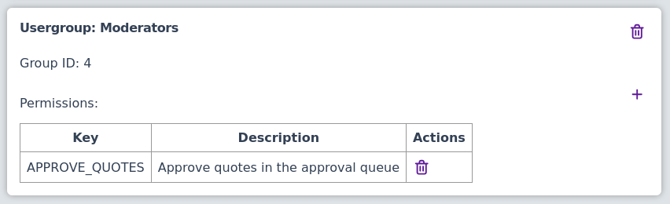

# Security

## Superusers

The first registered user in Faridoon is granted superuser permissions (`SUPERUSER`, Admins group). All registrations after that join the Users group with no privileges by default (they can be upgraded later).

On a public deployment, turn off open sign-ups after creating your admin account via **Settings → enable registration**.

## Setting up a moderators usergroup

You can create a usergroup for moderators. Grant `APPROVE_QUOTES` (and optionally `BYPASS_APPROVAL`), then move trusted users into that group. It should look something like this:

## Guests

Guests are not members of a group and have no privilege rows. What guests may do is controlled by Settings (cvars), not environment variables:

- **enable guest add** — whether logged-out visitors can submit quotes
- **enable registration** — whether new accounts can be created

See [Configuration](../configuration/index.md) for the full list of Settings keys.
